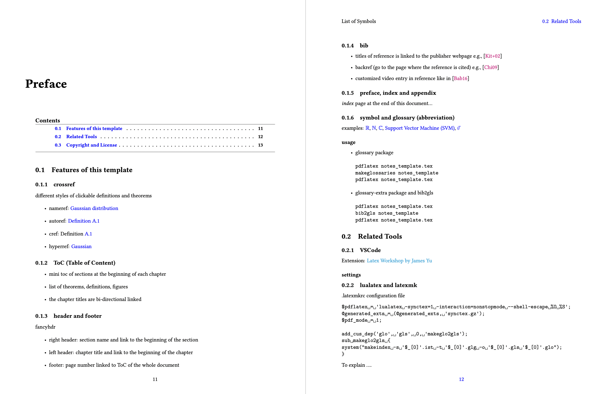

# Latex Template for Scientific Style Book (Notes)

## Features

- Cross-refs: link of definitions and theorems
- ToC: list of theorems, definitions, minitoc
- header and footer: hyperlink
- bib: hyperlink, backref, custom entry
- support index, glossary, symbol
- clean layout


## Preview
[Minimal working example](https://github.com/Jue-Xu/Latex-Template-for-Scientific-Style-Book/blob/main/notes_template.pdf)

[YouTube Preview](https://youtu.be/eR4vrsafcxk)

[Overleaf](https://www.overleaf.com/learn/latex/Glossaries)

my study notes [to do]

## Compile
This template works fine with the [Overleaf online compiler](https://www.overleaf.com/latex/templates/latex-template-for-scientific-style-book/ntprxjksmqxx) except the Glossary part (see below for more details)

###  lualatex and latexmk
`.latexmkrc` configuration file
```
$pdflatex = 'lualatex -synctex=1 -interaction=nonstopmode --shell-escape %O %S';
@generated_exts = (@generated_exts, 'synctex.gz');
$pdf_mode = 1;

add_cus_dep('glo', 'gls', 0, 'makeglo2gls');
sub makeglo2gls {
    system("makeindex -s '$_[0]'.ist -t '$_[0]'.glg -o '$_[0]'.gls '$_[0]'.glo");
}
```

### Glossary related
```
# Also delete the *.glstex files from package glossaries-extra. Problem is,
# that that package generates files of the form "basename-digit.glstex" if
# multiple glossaries are present. Latexmk looks for "basename.glstex" and so
# does not find those. For that purpose, use wildcard.
$clean_ext = "%R-*.glstex";

push @generated_exts, 'glstex', 'glg';

add_cus_dep('aux', 'glstex', 0, 'run_bib2gls');

# PERL subroutine. $_[0] is the argument (filename in this case).
# File from author from here: https://tex.stackexchange.com/a/401979/120853
sub run_bib2gls {
    if ( $silent ) {
    #    my $ret = system "bib2gls --silent --group '$_[0]'"; # Original version
        my $ret = system "bib2gls --silent --group $_[0]"; # Runs in PowerShell
    } else {
    #    my $ret = system "bib2gls --group '$_[0]'"; # Original version
        my $ret = system "bib2gls --group $_[0]"; # Runs in PowerShell
    };

    my ($base, $path) = fileparse( $_[0] );
    if ($path && -e "$base.glstex") {
        rename "$base.glstex", "$path$base.glstex";
    }

    # Analyze log file.
    local *LOG;
    $LOG = "$_[0].glg";
    if (!$ret && -e $LOG) {
        open LOG, "<$LOG";
    while (<LOG>) {
            if (/^Reading (.*\.bib)\s$/) {
        rdb_ensure_file( $rule, $1 );
        }
    }
    close LOG;
    }
    return $ret;
}
```

command line in terminal
```
pdflatex notes.tex
makeglossaries notes
pdflatex notes.tex
```

### bib2gls
need [Java](https://java.com/en/download/)
```
pdflatex notes.tex
bib2gls notes
pdflatex notes.tex
```

## Related Tools

### VSCode
Extension: [Latex Workshop by James Yu](https://marketplace.visualstudio.com/items?itemName=James-Yu.latex-workshop)

Extension Setting:
```
   "latex-workshop.latex.recipe.default":"latexmk",
    "latex-workshop.latex.recipes":[
        {
            "name": "latexmk",
            "tools": [
                "latexmk"
            ]
        }
    ],
    "latex-workshop.latex.tools":[
    {
        "name": "latexmk",
        "command": "latexmk",
        "args": [
            // "-pdflatex=lualatex",
            "-f",
            "-synctex=1",
            "-interaction=nonstopmode",
            "-file-line-error",
            "-pdf",
            "-outdir=%OUTDIR%",
            "%DOC%"
        ],
        "env": {}
    }
    }
```

### Zotero
https://www.zotero.org/

#### Better BibTeX
https://retorque.re/zotero-better-bibtex/

## License 
Creative Commons CC BY 4.0


Feel free to fork or modify this Repo.
Give me a star if this template is helpful to you.

If you have any question or suggestion, you could open an issue on GitHub.